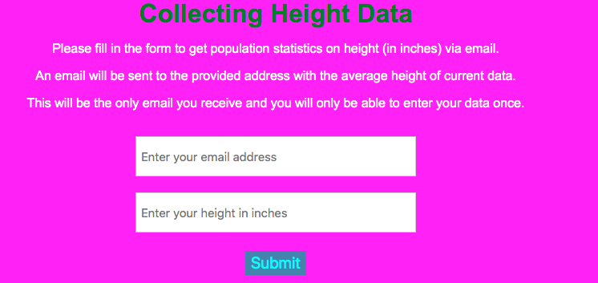

# Height Data Collector

A data collector web app built using Flask and PostgreSQL and deployed on Heroku at https://flask-data-collector.herokuapp.com/.

Fill in your email and height and you will receive an email with the average height of current data.

To clone for yourself:
[Note: You should know how to use a Python virtual environment before using this app, have Postgresql installed on your machine (and know your username/password) and create a database named `data_collector`.]
- Clone or download this repo to your local machine
- Activate your Python virtual environment
- Update the `app.config['SQLALCHEMY_DATABASE_URI']` in `app.py` with your appropriate data
- Run `pip install -r requirements.txt` to install dependencies
- Make sure you have your `data_collector` database created, and run `flask db upgrade`
- Finally, run `flask run` to start the server and open your browser to `localhost:5000` to use the app.

Credits: Adapted from online tutorial
